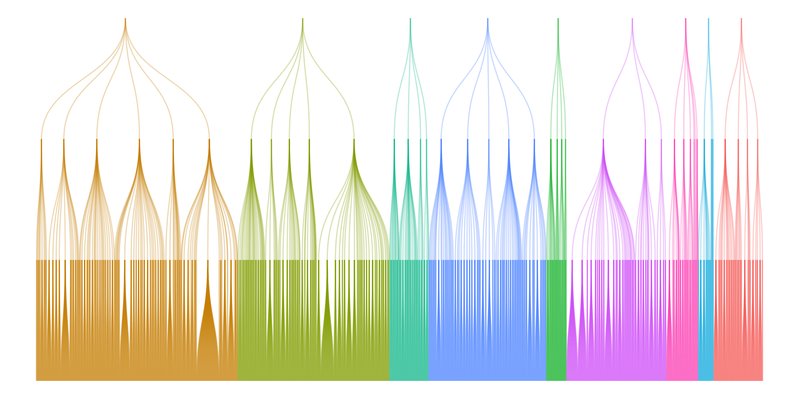

# Hierarchical classifier of job ads for job vacancy statistics



Repository with hierarchical classifier of 6 digits occupation codes ([KZiS 2023, as of 2024-07-31](https://psz.praca.gov.pl/rynek-pracy/bazy-danych/klasyfikacja-zawodow-i-specjalnosci)).

# Authors

+ Maciej Beręsewicz -- design of the classifier, data preparation and discussion
+ Marek Wydmuch -- main developer, author of Python module
+ Herman Cherniaiev -- data processing and preparation
+ Robert Pater -- labour market consultation

# How to use

## Instalation

Create new venv

```
python -m venv venv
```

Activate it with `source` and upgrade `pip`
```
pip install --upgrade pip
```

They will install the appropriate version of PyTorch with wonder support to match the current machine, e.g:

```
# np.:
pip install torch==1.2.0+cu92 torchvision==0.4.0+cu92 -f https://download.pytorch.org/whl/torch_stable.html
# lub
pip install torch
```

They will then install the rest of the dependencies (external requirements: Linux/MacOS, gcc/clang compiler, cmake)

```
pip install -r requirements.txt
```

### Running the script

Script arguments for learning and model prediction:

```
usage: main.py [options] classifier command

commands: 
  fit                             trenuj wybrany klasyfikator
  predict                         dokonaj predykcji za pomocą wybranego modelu

Klasyfikatory:
  LinearJobOffersClassifier
  TransformerJobOffersClassifier
  
Opcje:
  -x, --features_data TEXT        Cechy w postaci tekstowe, jeden przykład per linia [wymagane]
  -y, --labels_data TEXT          Etykiety w postaci tekstowe (kody zawodów), jeden przykład per linia
  -h, --hierarchy_data TEXT       Plik z hierarchią w formacie takim jak w train_test_data/classes_*.tsv
  -m, --model_dir TEXT            Folder do/z którego zapisać/wczytać model [wymagane]

  -t, --transformer_model TEXT    Bazowy model do tuningu [wymagane, tylko dla TransformerJobOffersClassifier]
  -tc, --transformer_ckpt_path TEXT   Folder do zapisanego modelu, by wykorzystać go do dalszego trenowania [tylko dla TransformerJobOffersClassifier]
  -mm, --modeling_mode TEXT       Tryb modelowania hierarchi [tylko dla TransformerJobOffersClassifier]
                                      
  -l, --learning_rate FLOAT       Bazowy rozmiar kroku podczas uczenia [tylko dla TransformerJobOffersClassifier]
  -w, --weight_decay FLOAT        Stała regularyzacyjna, im większa, tym większa regularyzacja [tylko dla TransformerJobOffersClassifier]
  -e, --max_epochs INTEGER        Maksymalna ilość epok uczenia [tylko dla TransformerJobOffersClassifier]
  -b, --batch_size INTEGER        Wielkość batcha podczas trenowania/testowana, większy rozmiar wymaga więcej pamięci [tylko dla TransformerJobOffersClassifier]
  --max_sequence_length INTEGER   Ilość słów od początku tekstu, która zostanie uwzględniona przez klasyfikator (512 to maksymalna ilość dla tej architektury), im większa wartość tym większe zapotrzebowanie pamięciowe i wolniejsze uczenie/predykcja [tylko dla TransformerJobOffersClassifier]
  
  --early_stopping BOOLEAN        Zastosuj wcześniejsze kończenie treningu, jeśli nie zostanie osiągnięta wystarczająca poprawa na stracie [tylko dla TransformerJobOffersClassifier]
  --early_stopping_delta FLOAT    Próg tolerancja na warunek stopu [tylko dla TransformerJobOffersClassifier]
  --early_stopping_patience INTEGER   Zakończ po tej ilości epok bez poprawy o próg tolerancji [tylko dla TransformerJobOffersClassifier]
                    
  -T, --threads INTEGER           Ilość wątków procesora wykorzystana przy uczeniu i predykcji       
  -D, --devices INTEGER           Ilość wykorzystywanych akceleratorow
  -P, --precision INTEGER         Precyzja obliczeń na GPU, niższa precyzja (16 bitów) pozwala na szybsze uczenie większego modelu [tylko dla TransformerJobOffersClassifier]
  
  --eps FLOAT                     Warunek stopu uczenia [tylko dla LinearJobOffersClassifier]
  -c, --cost FLOAT                Kontroluje regularyzacje, większa wartość = mniejsza regularyzacja [tylko dla LinearJobOffersClassifier]
  -e, --ensemble INTEGER          Zespół ilu klasyfikatorów użyć, jeśli wartość > 1, zostanie użyty zespół klasyfikatorów, które same spróbują okryć dobrą hierarchię klass aby wprowadzić element losowy [tylko dla LinearJobOffersClassifier]
  --use_provided_hierarchy BOOL   Jeżeli ensemble = 1 i use_provided_hierarchy = True, zostanie użyta podana hierarchia w agumencie hierarchy [tylko dla LinearJobOffersClassifier]
  --tfidf_vectorizer_min_df INTEGER   Minimalna ilość wystąpień token w zbiorze treningowym [tylko dla LinearJobOffersClassifier]

  -p, --pred_path TEXT            Ścieżka do której zapisać wynik predykcji macierz numpy w formacie tekstowym (numpy.savetxt/loadtxt)
```

## Tutorial on colab

+ [installation and prediction](https://colab.research.google.com/drive/1a425aagT0lczRxXPWoUlf5aFxUII37nh?usp=sharing)

# Citation

TBA

# Funding

+ Cherniaiev Herman, Pater Robert, Wydmuch Marek work and research was conducted in the Educational Research Institute at Warsaw, and funded by the Polish Ministry of Education and Science within a project *Supporting IQS functioning and improvements in order to use its solutions in achieving the country's development strategy aims* (ZSK5). 
+ Maciej Beręsewicz work was funded by the Polish National Agency for Academic Exchange (NAWA) under The Bekker NAWA Programme, grant number BPN/BEK/2023/1/00099/U/00001 (visit at University of Manchester between 01.06 and 31.08.2024).

[](https://nawa.gov.pl/en/)